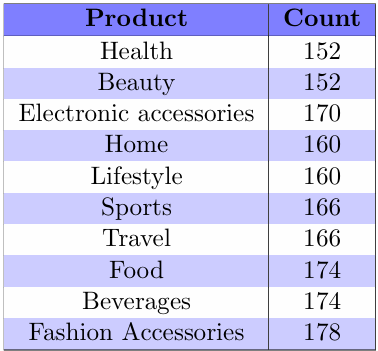
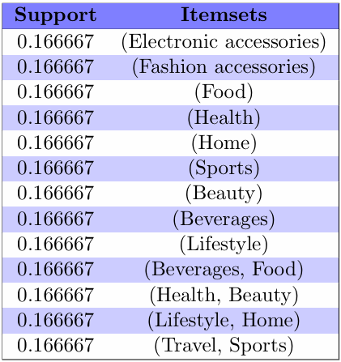
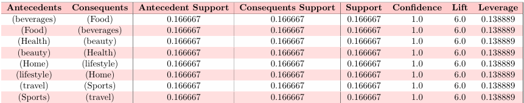
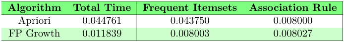
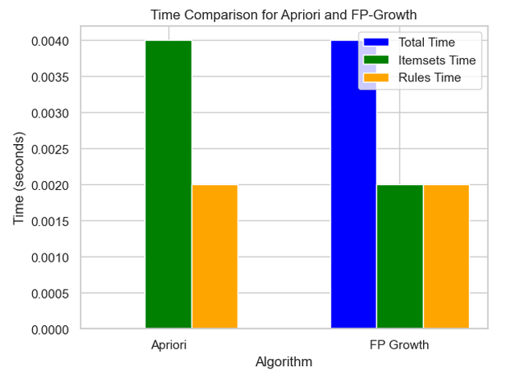
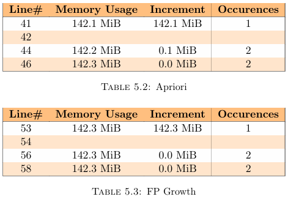

# Supermarket Sales Data Mining Project

## Overview

This project explores customer behavior in supermarket sales using Python-based data mining techniques. The analysis covers association rule mining, classification, regression, outlier detection, and clustering. Temporal patterns in customer behavior are also examined using sequential pattern mining and time-series analysis. The repository contains all essential files for understanding and replicating the research.

## Repository Contents

- **Jupyter Notebook**: Contains the Python code used for data mining and analysis.
- **Research Report (PDF)**: The final research document with insights, analysis, and conclusions.
- **LaTeX Files**: Resources for formatting research papers using LaTeX.
- **Dataset**: The supermarket sales dataset (`supermarket_sales.csv`), located in the `additional_files` directory.

## Key Insights and Visualizations

### **1. Product Distribution and Frequent Itemsets**

#### Product Count Distribution

The table below shows the frequency of different product categories, helping identify the most commonly purchased items.



```python
apriori_df = pd.DataFrame(exploded_list, columns=['Product'])
apriori_df['Count'] = apriori_df.groupby('Product')['Product'].transform('count')
apriori_df = apriori_df.drop_duplicates().reset_index(drop=True)
apriori_df
```

#### Frequent Itemsets

Frequent itemsets highlight products that often appear together in transactions, essential for understanding purchasing behavior.



```python
tx = TransactionEncoder()
encoded_array = tx.fit(transactions_list).transform(transactions_list)
encoded_df = pd.DataFrame(encoded_array, columns=tx.columns_, dtype=int)
frequent_itemsets = apriori(encoded_df, min_support=0.01, use_colnames=True)
frequent_itemsets
```

### **2. Association Rule Mining and Evaluation**

Once frequent itemsets were identified, association rule mining was applied using the Apriori algorithm. Key mathematical metrics include:

#### **Key Formulae:**

- **Confidence:** Measures the likelihood of purchasing B given that A was purchased.
  $$
  Confidence(A \rightarrow B) = \frac{Support(A \cup B)}{Support(A)}
  $$
- **Lift:** Determines how much more likely two products are bought together than independently.
  $$
  Lift(A \rightarrow B) = \frac{Support(A \cup B)}{Support(A) \times Support(B)}
  $$
- **Leverage:** Measures the difference between observed and expected co-occurrence.
  $$
  Leverage(A \rightarrow B) = Support(A \cup B) - Support(A) \times Support(B)
  $$

### **3. Strongest Association Rules**

The table below highlights the most significant association rules discovered.



**Key Findings:**

- Confidence values of **1.0** indicate strong certainty in customer purchasing behavior.
- A lift value of **6.0** suggests that purchasing one item significantly increases the likelihood of buying the associated item.
- These insights help optimize marketing strategies and personalized recommendations.

### **4. Comparative Analysis with FP-Growth Algorithm**

#### **Execution Time Comparison**

A comparison between Apriori and FP-Growth algorithms was conducted to analyze their efficiency. The table below presents the total execution time, time taken for frequent itemset generation, and association rule mining.



```python
start_time_apriori = time.time()
frequent_itemsets_apriori = apriori(encoded_df, min_support=0.01, use_colnames=True)
rules_apriori = association_rules(frequent_itemsets_apriori, metric="confidence", min_threshold=0.01)
end_time_apriori = time.time()
apriori1 = end_time_apriori - start_time_apriori
```

To compare the times of both algorithms, a DataFrame was created:

```python
execution_times_df = pd.DataFrame(columns=['Algorithm', 'Total', 'Itemsets', 'Rules'])
apriori_df = pd.DataFrame({'Algorithm': ['Apriori'], 'Total': [apriori1], 'Itemsets': [apriori2], 'Rules': [apriori3]})
fp_growth_df = pd.DataFrame({'Algorithm': ['FP Growth'], 'Total': [fp1], 'Itemsets': [fp2], 'Rules': [fp3]})
execution_times_df = pd.concat([execution_times_df, apriori_df, fp_growth_df], ignore_index=True)
execution_times_df
```

The comparison of execution times was also visualized:



#### **Memory Usage Comparison**

Both Apriori and FP-Growth algorithms were analyzed for their memory usage. The tables below show memory consumption for both approaches.



A profiling script was used to track memory usage:

```python
@profile
def apriori_algorithm(encoded_df):
    start_mem_apriori = time.time()
    frequent_itemsets_apriori = apriori(encoded_df, min_support=0.01, use_colnames=True)
    rules_apriori = association_rules(frequent_itemsets_apriori, metric="confidence", min_threshold=0.01)
    end_mem_apriori = time.time()
    apriori1_mem = end_mem_apriori - start_mem_apriori
    print(apriori1_mem)
```

#### **Key Findings:**

- **FP-Growth is significantly faster** than Apriori, requiring fewer computations for large datasets.
- **Memory usage is more efficient** in FP-Growth, making it suitable for large-scale applications.
- While Apriori is easier to understand, FP-Growth is more scalable and optimized.

## Conclusion

This project provides deep insights into supermarket purchasing patterns. By leveraging association rule mining, clustering, and time-series forecasting, businesses can:

- Optimize inventory management.
- Implement effective cross-selling strategies.
- Enhance targeted promotions based on customer behavior.

## Acknowledgments

- **Libraries Used**: Pandas, NumPy, Matplotlib, Seaborn, Scikit-learn, Mlxtend, Statsmodels.
- **Dataset Source**: Included within the repository.

## License

This project is open-source and available under the MIT License.
