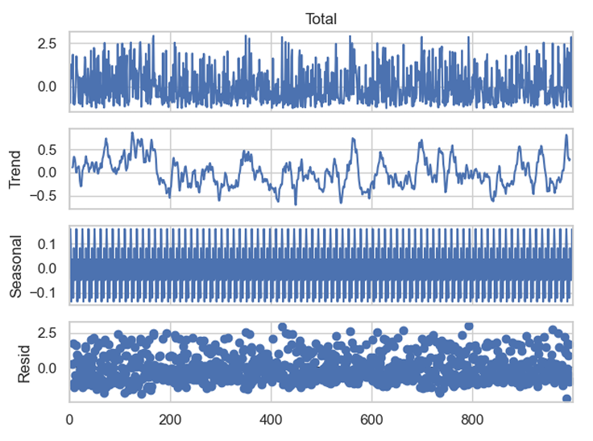
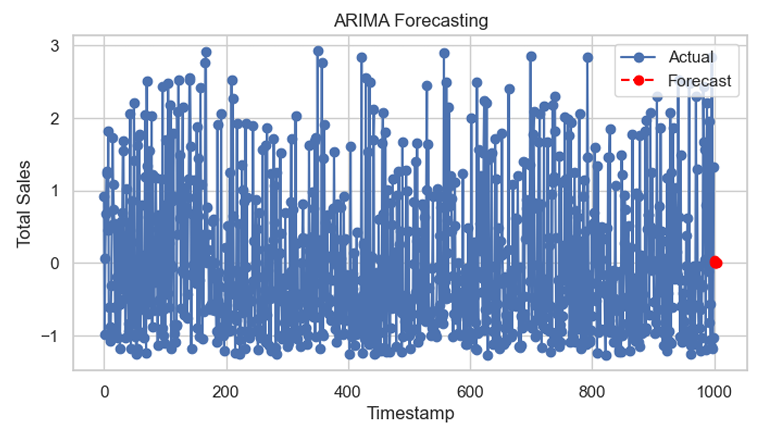
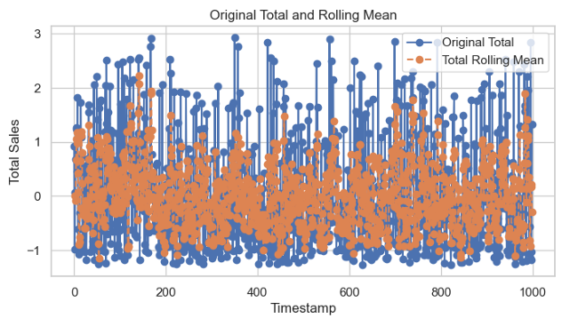

# Supermarket Sales Data Mining Project

## Overview

This project explores customer behavior in supermarket sales using Python-based data mining techniques. The analysis covers association rule mining, classification, regression, outlier detection, and clustering. Temporal patterns in customer behavior are also examined using sequential pattern mining and time-series analysis. The repository contains all essential files for understanding and replicating the research.

## Repository Contents

- **Jupyter Notebook**: Contains the Python code used for data mining and analysis - [Notebook](code.ipynb).
- **Research Report (PDF)**: The final research document with insights, analysis, and conclusions - [Report](Research-Report.pdf).
- **Dataset**: The supermarket sales dataset located in the `additional_files` directory - [supermarket-sales.csv](additional_files/supermarket-sales.csv).
- **LaTeX Files**: Resources for formatting research papers using LaTeX.

## Key Insights and Visualizations

### **1. Product Distribution and Frequent Itemsets**

#### Product Count Distribution

The table below shows the frequency of different product categories, helping identify the most commonly purchased items.


```python
apriori_df = pd.DataFrame(exploded_list, columns=['Product'])
apriori_df['Count'] = apriori_df.groupby('Product')['Product'].transform('count')
apriori_df = apriori_df.drop_duplicates().reset_index(drop=True)
apriori_df
```

#### Frequent Itemsets

Frequent itemsets highlight products that often appear together in transactions, essential for understanding purchasing behavior.


```python
tx = TransactionEncoder()
encoded_array = tx.fit(transactions_list).transform(transactions_list)
encoded_df = pd.DataFrame(encoded_array, columns=tx.columns_, dtype=int)
frequent_itemsets = apriori(encoded_df, min_support=0.01, use_colnames=True)
frequent_itemsets
```

### **2. Association Rule Mining and Evaluation**

Once frequent itemsets were identified, association rule mining was applied using the Apriori algorithm. Key mathematical metrics include:

#### **Key Formulae:**

- **Confidence:** Measures the likelihood of purchasing B given that A was purchased.  
  **Confidence(A → B)** = Support(A ∪ B) / Support(A)

- **Lift:** Determines how much more likely two products are bought together than independently.  
  **Lift(A → B)** = Support(A ∪ B) / (Support(A) × Support(B))

- **Leverage:** Measures the difference between observed and expected co-occurrence.  
  **Leverage(A → B)** = Support(A ∪ B) − Support(A) × Support(B)

### **3. Strongest Association Rules**

The table below highlights the most significant association rules discovered.


### **4. Comparative Analysis with FP-Growth Algorithm**

#### **Execution Time Comparison**


#### **Memory Usage Comparison**


### **5. Time-Series Analysis and Forecasting**

#### **Seasonal Decomposition**

Using the `seasonal_decompose` function, the time-series data was broken down into key components: trend, seasonality, and residual.



```python
scaler = StandardScaler()
numerical_cols = ['Unit price', 'Quantity', 'Tax 5%', 'Total', 'cogs', 'gross income', 'Rating']
df5[numerical_cols] = scaler.fit_transform(df5[numerical_cols])

result = seasonal_decompose(df5['Total'], model='additive', period=12)
```

- **Observed Component:** Captures fluctuations in the original time series.
- **Trend Component:** Highlights long-term patterns in sales.
- **Seasonal Component:** Identifies repeating seasonal trends.
- **Residual Component:** Shows remaining variability after extracting trend and seasonality.

#### **Predictive Modeling Using ARIMA**

ARIMA (AutoRegressive Integrated Moving Average) was applied to forecast future sales trends.



```python
model = ARIMA(df5['Total'], order=(1, 1, 1))
result = model.fit()

# Generate forecast for the next 5 time points
forecast_steps = 5
forecast = result.get_forecast(steps=forecast_steps).predicted_mean
```

**Key Insights:**

- ARIMA effectively captures historical patterns to predict future sales.
- The model suggests a stable or slow-changing trend in customer behavior.

#### **Rolling Mean for Trend Analysis**

To smooth out short-term fluctuations and highlight long-term trends, a rolling mean was calculated.

```python
df5['Total_Rolling_Mean'] = df5['Total'].rolling(window=3).mean()
```



- **Frequent fluctuations in total sales** are observed, likely influenced by daily transactions.
- The rolling mean smooths out these fluctuations to provide a clearer trend.

## Conclusion

This project provides deep insights into supermarket purchasing patterns. By leveraging association rule mining, clustering, and time-series forecasting, businesses can:

- Optimize inventory management.
- Implement effective cross-selling strategies.
- Enhance targeted promotions based on customer behavior.

## Acknowledgments

- **Libraries Used**: Pandas, NumPy, Matplotlib, Seaborn, Scikit-learn, Mlxtend, Statsmodels.
- **Dataset Source**: Included within the repository [here](additional_files/supermarket-sales.csv).

## License

This project is open-source and available under the MIT License.
